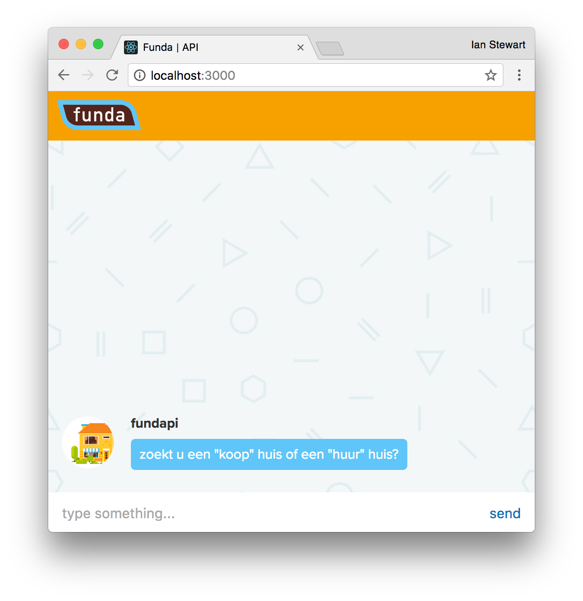

# funda-server-side
> Refactoring funda web app to have server side rendering. See [funda web app here](https://github.com/IanCStewart/minor-funda)

## The Project

The concept is a conversational ui. Through the conversation the app will determine what ur after in a home. Through these answers the app will be able to fetch houses for your specific choice.



## Cloning

```
$ cd ~/Sites/ && git clone git@github.com:IanCStewart/funda-server-side.git
```

Get the node modules:
```
$ npm i
```

## Building & Deployment

```
$ cd funda-server-side && touch .env && vim .env
```

Fill `.env` with Funda and Google API keys. For exmaple:
```
FUNDA_KEY=Y2o3uRf34Un54dAK56ey3HErE
GOOGLE_KEY=Y2o3uRg34Oo54GleK56ey3HErE
```

Build the `funda.js` file:
```
$ npm run build
```

Run on localhost:
```
$ npm start
```

Terminal should return something like this:
```
[nodemon] 1.11.0
[nodemon] to restart at any time, enter `rs`
[nodemon] watching: *.*
[nodemon] starting `node server.js`
started on port 3000!
______                    _            ___  ______  _____
|  ___|                  | |          / _ \ | ___ \|_   _|
| |_    _   _  _ __    __| |  __ _   / /_\ \| |_/ /  | |  
|  _|  | | | || '_ \  / _` | / _` |  |  _  ||  __/   | |  
| |    | |_| || | | || (_| || (_| |  | | | || |     _| |_
\_|     \__,_||_| |_| \__,_| \__,_|  \_| |_/\_|     \___/
```

If `npm start` throws an `error` please check if port `3000` is free.

## Developing

To make developing easier i have added some shortcuts for this.

Watch build files:
```
$ npm run watch-build
```

Nodemon server.js:
```
$ npm run start-dev
```

## Todo

- [ ] Add [levenshtein-edit-distance](https://www.npmjs.com/package/levenshtein-edit-distance)
- [ ] Make fundapi smarter through could be possible answer with levenshtein-edit-distance
- [ ] Make offline page more usefull instead of > (killed the dino!)

## Audits
